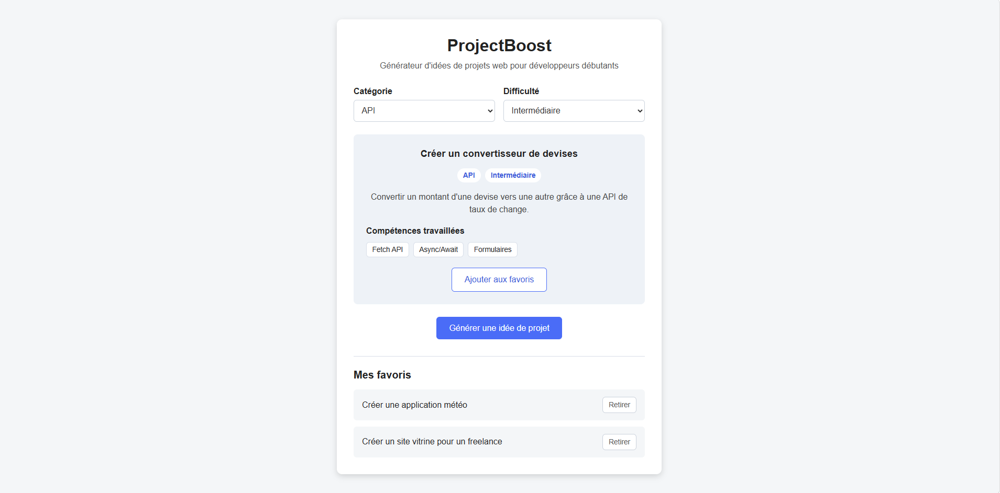

# ProjectBoost

ProjectBoost est un générateur d'idées de projets web destiné aux développeurs débutants.

L'application permet de générer aléatoirement une idée de projet selon une catégorie et un niveau de difficulté, puis d'afficher les compétences associées au projet.

## Aperçu



## Démo

[Voir ProjectBoost en ligne](https://garanceguinet.github.io/projectboost-idea-generator/)

## Fonctionnalités

- génération aléatoire d'idées de projets ;
- filtrage par catégorie : HTML/CSS, JavaScript ou API ;
- filtrage par niveau de difficulté ;
- affichage du titre, de la description et des compétences travaillées ;
- prévention de l'affichage consécutif de la même idée ;
- gestion du cas où aucun projet ne correspond aux filtres sélectionnés ;
- ajout et suppression de projets favoris ;
- sauvegarde des favoris dans le navigateur avec `localStorage` ;
- conservation des favoris après actualisation de la page ;
- interface responsive adaptée aux écrans mobiles et desktop.

## Technologies

- HTML5
- CSS3
- JavaScript
- DOM
- Local Storage

Aucune librairie ni framework n'est utilisé.

## Fonctionnement

Les idées de projets sont stockées sous forme d'objets JavaScript contenant plusieurs informations :

```javascript
{
  title: "Développer une to-do list",
  category: "JavaScript",
  difficulty: "Débutant",
  description:
    "Créer une application permettant d'ajouter, terminer et supprimer des tâches.",
  skills: ["DOM", "Événements", "Tableaux"],
}
```

Les filtres sélectionnés par l'utilisateur sont appliqués avec `Array.filter()` avant la génération aléatoire d'une idée.

Les favoris sont enregistrés dans le `localStorage` du navigateur afin d'être conservés entre les différentes visites.

## Accessibilité

L'interface comprend notamment :

- des labels associés aux différents filtres ;
- des styles `:focus-visible` pour la navigation au clavier ;
- des zones dynamiques utilisant `aria-live` afin de signaler les changements de contenu ;
- des boutons de suppression disposant d'un libellé accessible spécifique au projet concerné.

## Responsive

L'interface s'adapte aux différentes tailles d'écran.

Sur mobile :

- les filtres passent en colonne ;
- les boutons occupent l'espace disponible ;
- les favoris s'adaptent à la largeur de l'écran.

## Structure du projet

```text
projectboost-idea-generator/
├── assets/
│   └── images/
│       └── preview.png
├── index.html
├── style.css
├── script.js
├── README.md
└── .gitattributes
```

## Lancement

Aucune installation n'est nécessaire.

Le projet peut être ouvert directement depuis `index.html` ou lancé avec un serveur local comme Live Server.